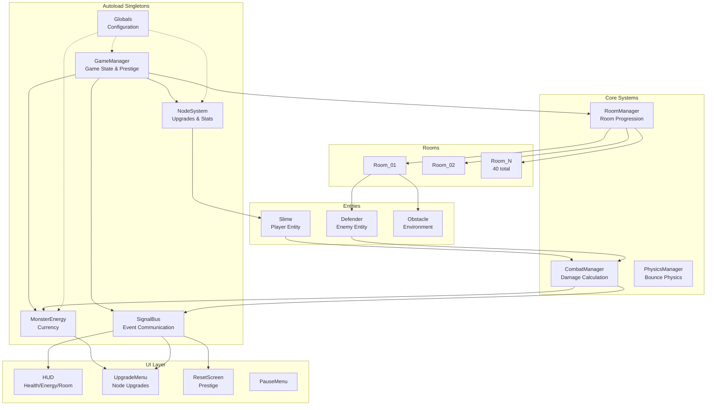
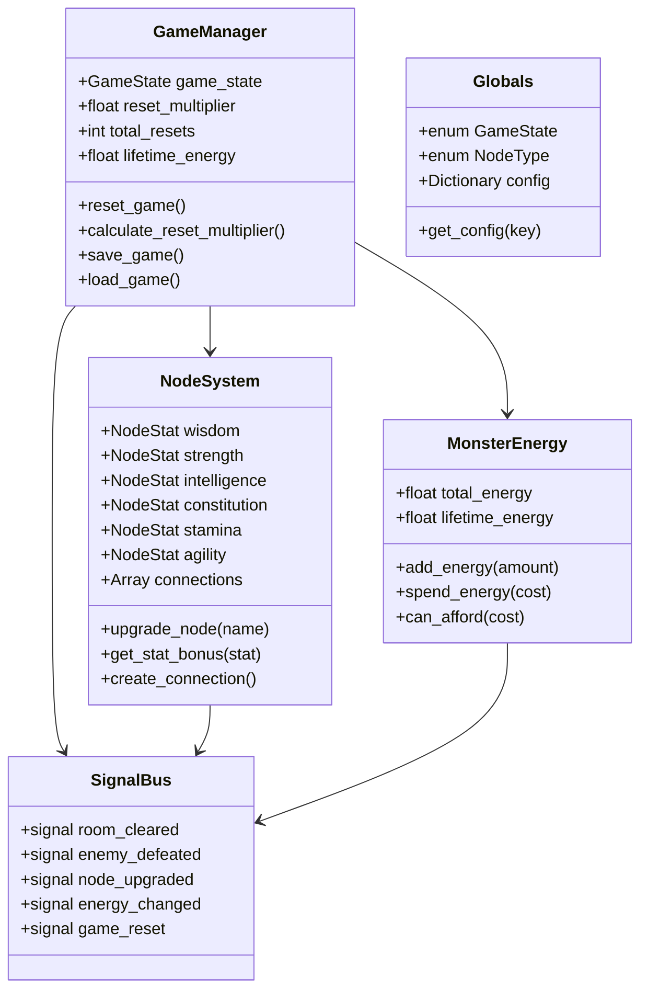
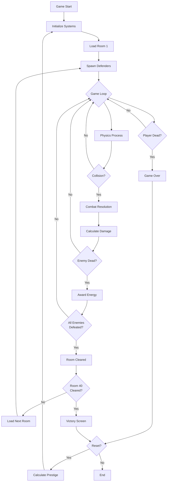
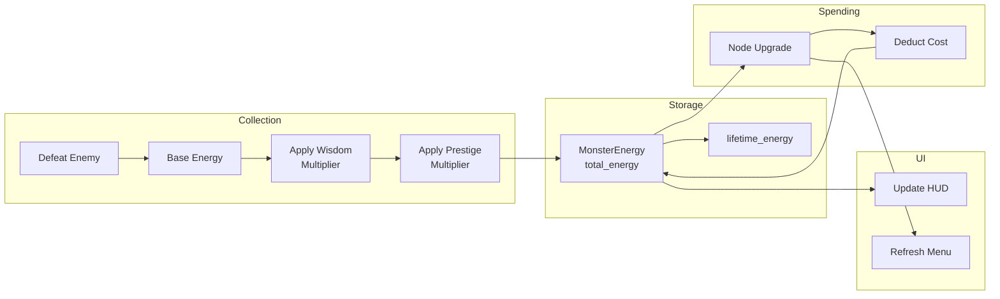
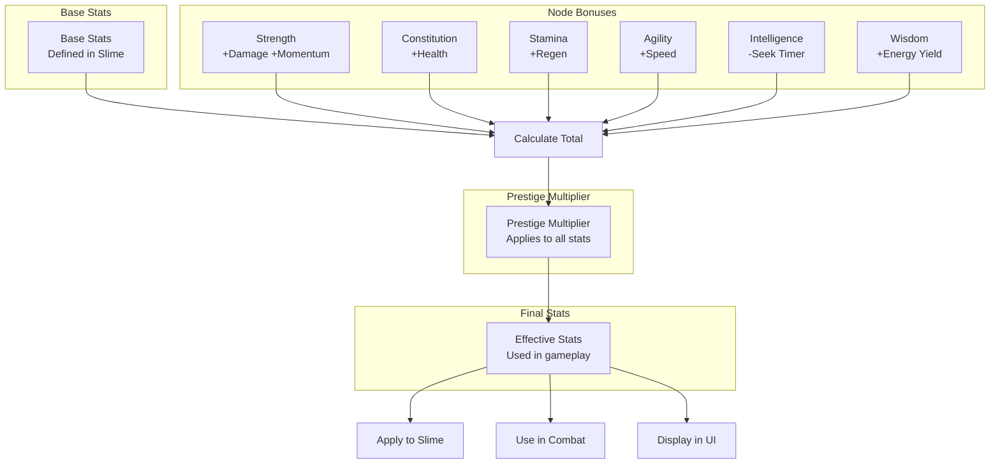
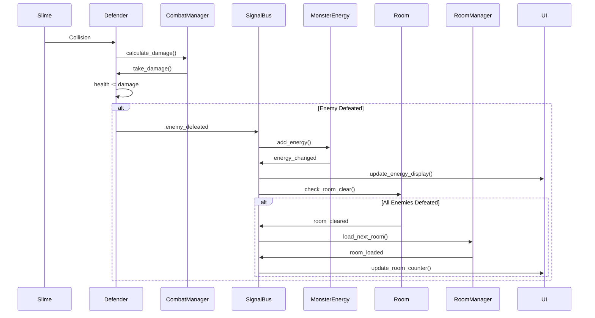
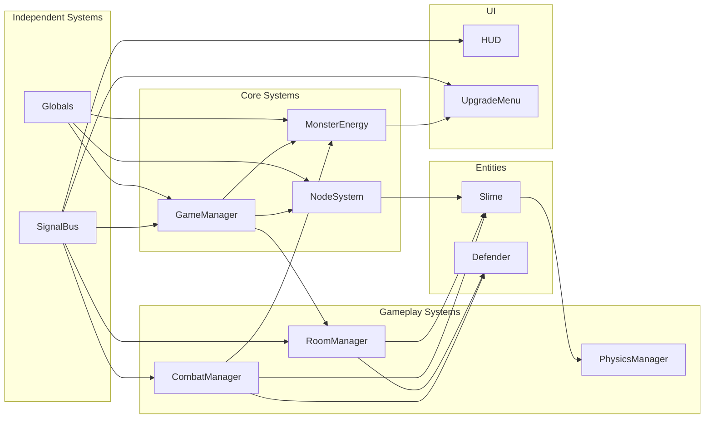

# Slime Dungeon - Architecture Overview

**Last Updated:** 2025-11-18  
**Purpose:** High-level system architecture and component relationships

---

## Table of Contents
1. [System Architecture](#system-architecture)
2. [Autoload Singletons](#autoload-singletons)
3. [Scene Hierarchy](#scene-hierarchy)
4. [Data Flow](#data-flow)
5. [Signal Communication](#signal-communication)
6. [Integration Points](#integration-points)

---

## System Architecture

### High-Level Component Diagram



### Component Responsibilities

| Component | Type | Responsibility |
|-----------|------|----------------|
| **GameManager** | Autoload | Game state, reset/prestige, save/load |
| **NodeSystem** | Autoload | 6 upgrade nodes, connections, stat bonuses |
| **MonsterEnergy** | Autoload | Currency collection, spending, tracking |
| **SignalBus** | Autoload | Decoupled event communication |
| **Globals** | Autoload | Configuration constants, enums |
| **RoomManager** | System | Room loading, transitions, difficulty scaling |
| **CombatManager** | System | Damage calculation, combat resolution |
| **PhysicsManager** | System | Bounce physics, momentum (optional) |
| **Slime** | Entity | Player character, autonomous movement |
| **Defender** | Entity | Enemy, stationary attacks |
| **Obstacle** | Entity | Environmental objects, seekable targets |
| **Room** | Scene | Individual room logic, victory conditions |
| **UI** | Layer | User interface, menus, HUD |

---

## Autoload Singletons

### Singleton Architecture



### Autoload Configuration

**File:** `project.godot`

```ini
[autoload]
Globals="*res://autoloads/Globals.gd"
GameManager="*res://autoloads/GameManager.gd"
NodeSystem="*res://autoloads/NodeSystem.gd"
MonsterEnergy="*res://autoloads/MonsterEnergy.gd"
SignalBus="*res://autoloads/SignalBus.gd"
```

**Load Order:** Globals → GameManager → NodeSystem → MonsterEnergy → SignalBus

---

## Scene Hierarchy

### Main Scene Structure

```
Main.tscn (Root Scene)
├── RoomManager (Node)
│   ├── CurrentRoom (Node2D) - Active room container
│   └── NextRoomPlaceholder (Node2D) - Preload next room
├── Slime (CharacterBody2D) - Player entity
├── UI (CanvasLayer)
│   ├── HUD (Control)
│   ├── NodeUpgradeMenu (Control)
│   ├── ResetScreen (Control)
│   └── PauseMenu (Control)
└── Camera2D - Follows slime
```

### Room Scene Structure

```
Room.tscn (Template)
├── TileMap (TileMap) - Walls, floor, decorations
├── Defenders (Node2D) - Container for enemy spawns
│   └── Defender instances (spawned at runtime)
├── Obstacles (Node2D) - Container for environmental objects
│   └── Obstacle instances
└── ExitZone (Area2D) - Triggers room completion
    └── CollisionShape2D
```

### Entity Scene Structure

```
Slime.tscn
├── Sprite2D (Slime sprite)
├── CollisionShape2D (Physics collision)
├── DetectionZone (Area2D) - Enemy detection
├── MomentumTrail (Line2D) - Visual feedback
├── FocusIndicator (Sprite2D) - Target indicator
└── AutoSeekTimer (Timer) - Auto-seek countdown

Defender.tscn
├── Sprite2D (Enemy sprite)
├── CollisionShape2D (Physics collision)
├── AttackRange (Area2D) - Attack detection
│   └── CollisionShape2D
├── HealthBar (ProgressBar) - Visual health
└── AttackTimer (Timer) - Attack cooldown

Obstacle.tscn
├── Sprite2D (Obstacle sprite)
└── CollisionShape2D (Static collision)
```

---

## Data Flow

### Game Loop Data Flow



### Energy Flow



### Stat Calculation Flow



---

## Signal Communication

### Signal Architecture



### Key Signals

**SignalBus Signals:**
```gdscript
# Combat
signal enemy_defeated(enemy: Defender, energy_reward: float)
signal player_damaged(damage: float, current_health: float)
signal player_died()

# Room Progression
signal room_cleared(room_index: int)
signal room_loaded(room_index: int, difficulty: float)
signal all_rooms_cleared()

# Economy
signal energy_changed(current: float, delta: float)
signal energy_spent(amount: float, item: String)
signal insufficient_energy(cost: float, current: float)

# Upgrades
signal node_upgraded(node_name: String, new_level: int)
signal connection_created(from_node: String, to_node: String)
signal stat_changed(stat_name: String, new_value: float)

# Game State
signal game_reset()
signal prestige_calculated(multiplier: float)
signal game_paused(paused: bool)
signal game_over()
signal victory()
```

---

## Integration Points

### System Dependencies



### Critical Integration Points

| System A | System B | Integration Type | Data Exchanged |
|----------|----------|------------------|----------------|
| Slime | CombatManager | Method Call | Collision data, damage calculation |
| CombatManager | MonsterEnergy | Signal | Energy rewards |
| MonsterEnergy | UI | Signal | Energy amount, changes |
| NodeSystem | Slime | Method Call | Stat bonuses |
| Room | RoomManager | Signal | Room cleared, load next |
| GameManager | All Systems | Method Call | Reset, save/load |
| SignalBus | All Systems | Signal | Decoupled events |

---

## File Structure Reference

### Directory Organization

```
slime-dungeon-main/
├── autoloads/              # Singleton systems
│   ├── Globals.gd
│   ├── GameManager.gd
│   ├── NodeSystem.gd
│   ├── MonsterEnergy.gd
│   └── SignalBus.gd
├── scenes/
│   ├── core/
│   │   ├── Main.tscn       # Root scene
│   │   ├── GameManager.tscn
│   │   ├── NodeSystem.tscn
│   │   └── MonsterEnergy.tscn
│   ├── entities/
│   │   ├── Slime.tscn
│   │   ├── Defender.tscn
│   │   ├── Obstacle.tscn
│   │   └── Projectile.tscn
│   ├── rooms/
│   │   ├── Room.tscn       # Template
│   │   ├── Room_01.tscn
│   │   ├── Room_02.tscn
│   │   └── ... (up to Room_40.tscn)
│   ├── systems/
│   │   ├── CombatManager.tscn
│   │   ├── PhysicsManager.tscn
│   │   └── RoomScaler.tscn
│   └── ui/
│       ├── UI.tscn
│       ├── HUD.tscn
│       ├── NodeUpgradeMenu.tscn
│       ├── ResetScreen.tscn
│       └── PauseMenu.tscn
├── scripts/
│   ├── core/
│   │   ├── BaseEntity.gd
│   │   └── Utils.gd
│   ├── entities/
│   │   ├── Slime.gd
│   │   ├── Defender.gd
│   │   ├── Obstacle.gd
│   │   └── Projectile.gd
│   ├── systems/
│   │   ├── Room.gd
│   │   ├── RoomManager.gd
│   │   ├── CombatManager.gd
│   │   └── NodeStat.gd
│   └── ui/
│       ├── HUD.gd
│       ├── NodeUpgradeMenu.gd
│       ├── ResetScreen.gd
│       └── PauseMenu.gd
├── resources/
│   ├── nodes/              # NodeStat resources
│   │   ├── Wisdom.tres
│   │   ├── Strength.tres
│   │   ├── Intelligence.tres
│   │   ├── Constitution.tres
│   │   ├── Stamina.tres
│   │   └── Agility.tres
│   ├── defenders/          # Defender configurations
│   └── configs/            # Game configuration resources
└── docs/                   # Documentation
    ├── ARCHITECTURE.md (this file)
    ├── systems/
    │   ├── PHYSICS.md
    │   ├── COMBAT.md
    │   └── NODES.md
    └── ...
```

---

## Next Steps

For detailed system designs, see:
- [Physics System Design](systems/PHYSICS.md)
- [Combat System Design](systems/COMBAT.md)
- [Core Loop Design](GAME_DESIGN.md#core-loop)
- [Progression System Design](GAME_DESIGN.md#progression-system)
- [Node System Design](systems/NODES.md)
- [Energy System Design](GAME_DESIGN.md#energy-economy)
- [Prestige System Design](GAME_DESIGN.md#prestige-system)
- [UI System Design](systems/UI.md)

