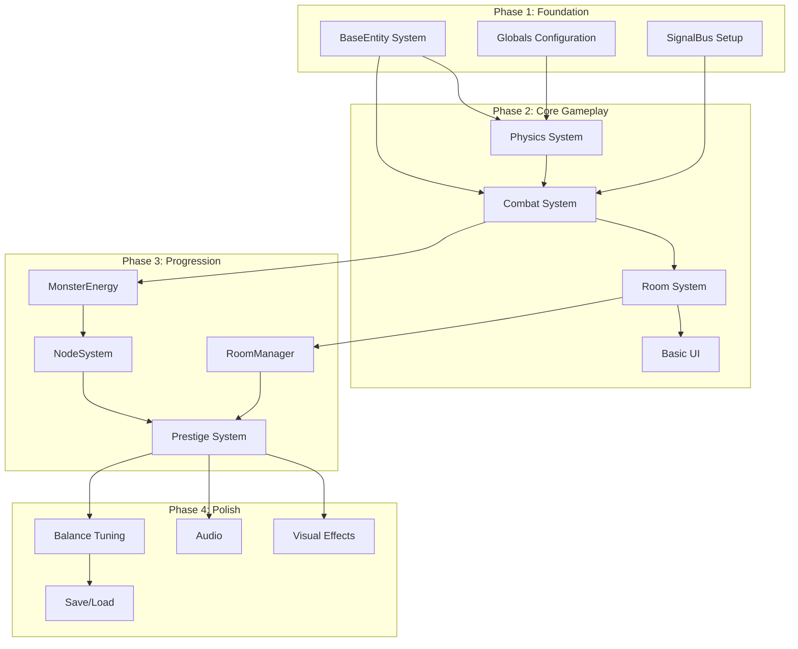

# Slime Dungeon - Implementation Roadmap

**Last Updated:** 2025-11-18  
**Purpose:** Step-by-step implementation guide with dependencies and priorities

---

## Table of Contents
1. [Implementation Overview](#implementation-overview)
2. [Phase 1: Foundation](#phase-1-foundation)
3. [Phase 2: Core Gameplay](#phase-2-core-gameplay)
4. [Phase 3: Progression Systems](#phase-3-progression-systems)
5. [Phase 4: Polish & Balance](#phase-4-polish--balance)
6. [Testing Strategy](#testing-strategy)

---

## Implementation Overview

### Dependency Graph



### Priority Levels

| Priority | Description | Timeline |
|----------|-------------|----------|
| **Critical** | Must have for MVP, blocks other work | Week 1 |
| **High** | Core gameplay features | Week 2 |
| **Medium** | Progression and polish | Week 3 |
| **Low** | Nice-to-have, post-MVP | Week 4+ |

---

## Phase 1: Foundation

**Goal:** Establish core infrastructure and base systems  
**Duration:** 1-2 days  
**Priority:** Critical

### Task 1.1: BaseEntity Health System

**Files:**
- `scripts/core/BaseEntity.gd`

**Steps:**
1. Implement health properties (max_health, current_health)
2. Implement take_damage(amount) method
3. Implement heal(amount) method
4. Implement die() method
5. Implement health regeneration in _process()
6. Add health_changed and died signals
7. Test with debug prints

**Acceptance Criteria:**
- ✅ Entity can take damage
- ✅ Entity dies when health <= 0
- ✅ Health regenerates over time
- ✅ Signals emit correctly

**Estimated Time:** 1-2 hours

---

### Task 1.2: Globals Configuration

**Files:**
- `autoloads/Globals.gd`

**Steps:**
1. Define GameState enum
2. Define NodeType enum
3. Add physics constants
4. Add collision layer constants
5. Add configuration dictionary
6. Add helper methods

**Code Template:**
```gdscript
extends Node

enum GameState {
    MENU,
    PLAYING,
    PAUSED,
    GAME_OVER,
    VICTORY
}

enum NodeType {
    WISDOM,
    STRENGTH,
    INTELLIGENCE,
    CONSTITUTION,
    STAMINA,
    AGILITY
}

const LAYER_WORLD = 1
const LAYER_PLAYER = 2
const LAYER_ENEMY = 3
const LAYER_PROJECTILE = 4

var config = {
    "physics": {
        "bounce_force": 300.0,
        "bounciness": 0.8,
        "min_velocity": 50.0
    },
    "combat": {
        "min_damage": 1.0
    },
    "progression": {
        "total_rooms": 40
    }
}

func get_config(path: String) -> Variant:
    var keys = path.split(".")
    var value = config
    for key in keys:
        if value is Dictionary and value.has(key):
            value = value[key]
        else:
            return null
    return value
```

**Acceptance Criteria:**
- ✅ Enums accessible globally
- ✅ Constants defined
- ✅ Config values retrievable

**Estimated Time:** 30 minutes

---

### Task 1.3: SignalBus Setup

**Files:**
- `autoloads/SignalBus.gd`

**Steps:**
1. Define all combat signals
2. Define all progression signals
3. Define all economy signals
4. Define all UI signals
5. Add signal documentation

**Code Template:**
```gdscript
extends Node

# Combat Signals
signal enemy_defeated(enemy: Node, energy_reward: float)
signal player_damaged(damage: float, current_health: float)
signal player_died()

# Room Progression Signals
signal room_cleared(room_index: int)
signal room_loaded(room_index: int, difficulty: float)
signal all_rooms_cleared()

# Economy Signals
signal energy_changed(current: float, delta: float)
signal energy_spent(amount: float, item: String)
signal insufficient_energy(cost: float, current: float)

# Upgrade Signals
signal node_upgraded(node_name: String, new_level: int)
signal connection_created(from_node: String, to_node: String)
signal stat_changed(stat_name: String, new_value: float)

# Game State Signals
signal game_reset()
signal prestige_calculated(multiplier: float)
signal game_paused(paused: bool)
signal game_over()
signal victory()
```

**Acceptance Criteria:**
- ✅ All signals defined
- ✅ Signals documented
- ✅ Accessible from any script

**Estimated Time:** 30 minutes

---

## Phase 2: Core Gameplay

**Goal:** Implement playable game loop  
**Duration:** 3-4 days  
**Priority:** Critical

### Task 2.1: Physics System (Slime Movement)

**Reference:** [systems/PHYSICS.md](systems/PHYSICS.md)

**Files:**
- `scripts/entities/Slime.gd`
- `scenes/entities/Slime.tscn`

**Steps:**
1. Remove platformer controls (1 hour)
2. Implement bounce physics (2 hours)
3. Implement momentum system (1 hour)
4. Implement auto-seek timer (1 hour)
5. Implement auto-seek targeting (2 hours)
6. Add visual feedback (1 hour)
7. Test in TestBounce.tscn (1 hour)

**Dependencies:**
- Task 1.2 (Globals)

**Acceptance Criteria:**
- ✅ Slime bounces autonomously
- ✅ No player input controls movement
- ✅ Momentum builds when moving
- ✅ Auto-seek activates after timer
- ✅ Visual trail shows momentum

**Estimated Time:** 8-10 hours

---

### Task 2.2: Combat System

**Reference:** [systems/COMBAT.md](systems/COMBAT.md)

**Files:**
- `scripts/core/BaseEntity.gd` (extend)
- `scripts/entities/Slime.gd` (extend)
- `scripts/entities/Defender.gd`
- `scripts/systems/CombatManager.gd`

**Steps:**
1. Extend BaseEntity with combat methods (1 hour)
2. Implement Slime collision damage (2 hours)
3. Implement Defender attack range (2 hours)
4. Implement Defender attack logic (2 hours)
5. Implement CombatManager damage calculation (2 hours)
6. Connect to MonsterEnergy rewards (1 hour)
7. Test in TestCombat.tscn (1 hour)

**Dependencies:**
- Task 1.1 (BaseEntity)
- Task 1.3 (SignalBus)
- Task 2.1 (Physics)

**Acceptance Criteria:**
- ✅ Slime damages enemies on collision
- ✅ Defenders attack when Slime in range
- ✅ Health bars update correctly
- ✅ Enemies die and emit signals
- ✅ Energy rewards granted

**Estimated Time:** 10-12 hours

---

### Task 2.3: Room System

**Files:**
- `scripts/systems/Room.gd`
- `scenes/rooms/Room.tscn`
- `scenes/rooms/Room_01.tscn`

**Steps:**
1. Implement defender spawning (2 hours)
2. Implement victory condition checking (1 hour)
3. Implement exit zone activation (1 hour)
4. Add room_cleared signal (30 min)
5. Create 2-3 test rooms (2 hours)
6. Test room completion flow (1 hour)

**Dependencies:**
- Task 2.2 (Combat)

**Acceptance Criteria:**
- ✅ Defenders spawn on room load
- ✅ Room detects all enemies defeated
- ✅ Exit zone activates after clear
- ✅ room_cleared signal emits

**Estimated Time:** 6-8 hours

---

### Task 2.4: Basic UI (HUD)

**Files:**
- `scripts/ui/HUD.gd`
- `scenes/ui/HUD.tscn`

**Steps:**
1. Create health bar display (1 hour)
2. Create energy counter (1 hour)
3. Create room counter (1 hour)
4. Connect to SignalBus (1 hour)
5. Test UI updates (1 hour)

**Dependencies:**
- Task 1.3 (SignalBus)
- Task 2.2 (Combat)

**Acceptance Criteria:**
- ✅ Health bar shows current/max HP
- ✅ Energy counter updates on collection
- ✅ Room counter shows current room
- ✅ UI responds to signals

**Estimated Time:** 4-5 hours

---

## Phase 3: Progression Systems

**Goal:** Implement upgrade and progression mechanics  
**Duration:** 4-5 days  
**Priority:** High

### Task 3.1: MonsterEnergy System

**Files:**
- `autoloads/MonsterEnergy.gd`

**Steps:**
1. Implement energy storage (1 hour)
2. Implement add_energy() (1 hour)
3. Implement spend_energy() (1 hour)
4. Implement can_afford() (30 min)
5. Add energy_changed signal (30 min)
6. Connect to combat rewards (1 hour)
7. Test energy flow (1 hour)

**Dependencies:**
- Task 2.2 (Combat)

**Acceptance Criteria:**
- ✅ Energy collected on enemy defeat
- ✅ Energy can be spent
- ✅ Signals emit on changes
- ✅ UI updates correctly

**Estimated Time:** 5-6 hours

---

### Task 3.2: NodeSystem

**Reference:** [systems/NODES.md](systems/NODES.md)

**Files:**
- `autoloads/NodeSystem.gd`
- `scripts/systems/NodeStat.gd`
- `resources/nodes/*.tres` (6 files)

**Steps:**
1. Create NodeStat resource script (2 hours)
2. Create 6 NodeStat .tres files (1 hour)
3. Implement upgrade_node() (2 hours)
4. Implement get_stat_bonus() (2 hours)
5. Implement connection system (3 hours)
6. Connect to Slime stats (2 hours)
7. Create upgrade UI (4 hours)
8. Test upgrades (2 hours)

**Dependencies:**
- Task 3.1 (MonsterEnergy)

**Acceptance Criteria:**
- ✅ All 6 nodes upgradeable
- ✅ Costs calculated correctly
- ✅ Stat bonuses apply to Slime
- ✅ Connections work (1-3 slots)
- ✅ UI shows node levels and costs

**Estimated Time:** 16-18 hours

---

### Task 3.3: RoomManager & Progression

**Files:**
- `scripts/systems/RoomManager.gd`
- Create Room_03.tscn through Room_10.tscn (or procedural)

**Steps:**
1. Implement room loading (2 hours)
2. Implement difficulty scaling (2 hours)
3. Implement room transitions (2 hours)
4. Create/generate 40 rooms (6 hours or procedural)
5. Test progression (2 hours)

**Dependencies:**
- Task 2.3 (Room)

**Acceptance Criteria:**
- ✅ Rooms load sequentially
- ✅ Difficulty increases with room number
- ✅ Smooth transitions between rooms
- ✅ 40 rooms total

**Estimated Time:** 12-14 hours (or 6-8 with procedural generation)

---

### Task 3.4: Prestige/Reset System

**Files:**
- `autoloads/GameManager.gd`
- `scripts/ui/ResetScreen.gd`

**Steps:**
1. Implement reset_game() (2 hours)
2. Implement multiplier calculation (2 hours)
3. Implement state reset (2 hours)
4. Create reset UI (3 hours)
5. Test reset flow (2 hours)

**Dependencies:**
- Task 3.1 (MonsterEnergy)
- Task 3.2 (NodeSystem)

**Acceptance Criteria:**
- ✅ Reset calculates multiplier
- ✅ All systems reset correctly
- ✅ Multiplier persists
- ✅ UI shows reset benefits

**Estimated Time:** 10-12 hours

---

## Phase 4: Polish & Balance

**Goal:** Visual effects, audio, and game balance  
**Duration:** 3-4 days  
**Priority:** Medium

### Task 4.1: Visual Effects

**Files:**
- `effects/*.tscn`
- Particle systems

**Steps:**
1. Implement hit effects (2 hours)
2. Implement death effects (2 hours)
3. Implement bounce splash (2 hours)
4. Implement focus aura (2 hours)
5. Polish animations (3 hours)

**Estimated Time:** 10-12 hours

---

### Task 4.2: Audio System

**Files:**
- `scripts/systems/AudioManager.gd`
- Audio assets

**Steps:**
1. Create AudioManager (2 hours)
2. Add sound effects (3 hours)
3. Add music (2 hours)
4. Implement volume controls (2 hours)

**Estimated Time:** 8-10 hours

---

### Task 4.3: Balance Tuning

**Steps:**
1. Test difficulty curve (4 hours)
2. Adjust node costs (2 hours)
3. Adjust enemy stats (2 hours)
4. Adjust prestige formula (2 hours)
5. Playtest and iterate (6 hours)

**Estimated Time:** 15-20 hours

---

### Task 4.4: Save/Load System

**Files:**
- `scripts/systems/SaveSystem.gd`

**Steps:**
1. Implement save_game() (3 hours)
2. Implement load_game() (3 hours)
3. Implement auto-save (2 hours)
4. Test save/load (2 hours)

**Estimated Time:** 8-10 hours

---

## Testing Strategy

### Unit Testing

**Test Scenes:**
- `tests/TestBounce.tscn` - Physics system
- `tests/TestCombat.tscn` - Combat system
- `tests/TestUI.tscn` - UI system

### Integration Testing

**Test Flow:**
1. Start game → Room 1 loads
2. Slime bounces → Collides with enemy
3. Enemy takes damage → Enemy dies
4. Energy collected → UI updates
5. All enemies defeated → Room clears
6. Next room loads → Repeat
7. Upgrade nodes → Stats increase
8. Reset game → Multiplier applies

### Playtesting Checklist

- [ ] Slime movement feels good
- [ ] Combat is satisfying
- [ ] Progression feels rewarding
- [ ] UI is clear and responsive
- [ ] No game-breaking bugs
- [ ] Performance is smooth
- [ ] Balance feels fair

---

## Total Estimated Time

| Phase | Hours | Days (8hr/day) |
|-------|-------|----------------|
| Phase 1: Foundation | 2-3 | 0.5 |
| Phase 2: Core Gameplay | 28-35 | 4-5 |
| Phase 3: Progression | 43-50 | 5-6 |
| Phase 4: Polish | 41-52 | 5-7 |
| **Total** | **114-140** | **14-18** |

**Realistic Timeline:** 3-4 weeks for solo developer  
**MVP Timeline:** 2 weeks (Phases 1-3 only)

---

## Next Steps

1. Review this roadmap
2. Set up task tracking (GitHub Issues, Trello, etc.)
3. Start with Phase 1, Task 1.1
4. Follow dependency chain
5. Test frequently
6. Iterate based on feedback

