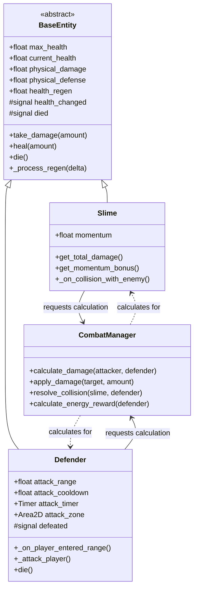
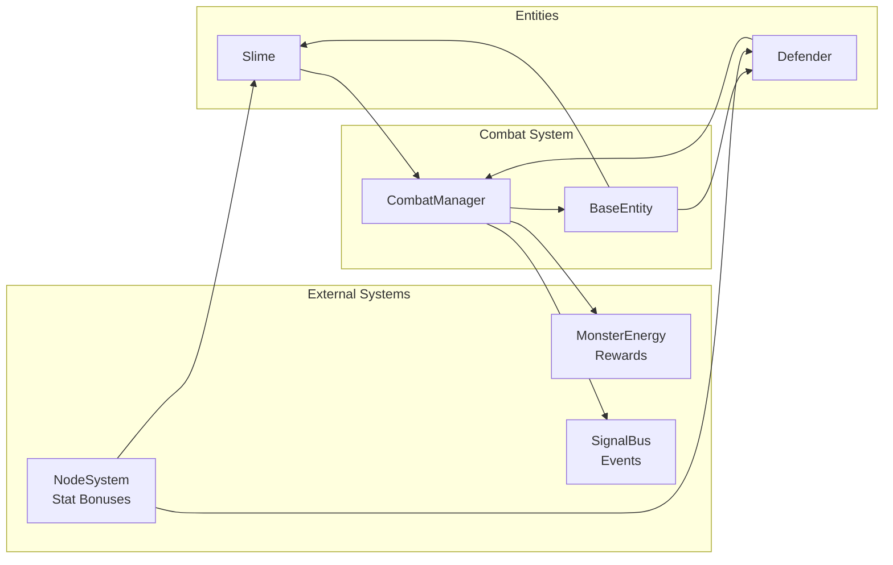
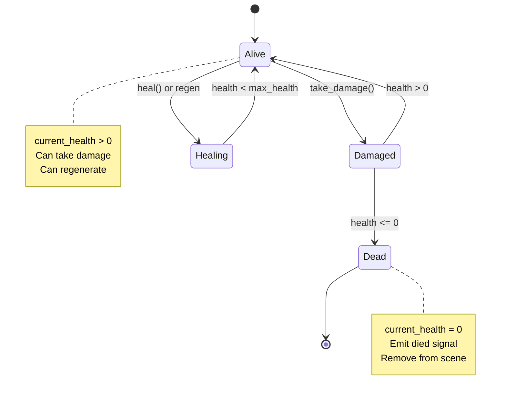

# Combat System Design

**Last Updated:** 2025-11-18  
**Status:** Design Complete - Ready for Implementation  
**Priority:** Critical (Core Mechanic)

---

## Table of Contents
1. [Overview](#overview)
2. [Architecture](#architecture)
3. [Damage Calculation](#damage-calculation)
4. [Health System](#health-system)
5. [Defender Attacks](#defender-attacks)
6. [Combat Flow](#combat-flow)
7. [File Structure](#file-structure)
8. [Implementation Steps](#implementation-steps)

---

## Overview

### Purpose
The Combat System manages all damage calculation, health management, and combat resolution between the Slime and Defenders. Combat is **collision-based** and **real-time**, not turn-based.

### Key Design Principles
- **Collision-Based:** Damage occurs when Slime collides with Defenders
- **Momentum Matters:** Slime's velocity affects damage output
- **Defender Zones:** Defenders attack when Slime enters their range
- **No Status Effects:** MVP uses pure physical damage only
- **Real-Time:** Continuous combat, no turns

### Core Mechanics
1. **Slime Attacks:** Collision damage + momentum bonus
2. **Defender Attacks:** Area-based periodic damage
3. **Health Management:** HP pools, regeneration, death
4. **Energy Rewards:** Monster Energy on enemy defeat

---

## Architecture

### Component Diagram



### System Interactions



---

## Damage Calculation

### Slime Damage Formula

```mermaid
flowchart TD
    Start[Collision with Defender] --> GetBase[Get Base Damage]
    GetBase --> GetNode[Get Node Bonuses<br/>Strength]
    GetNode --> GetMomentum[Get Momentum Bonus]
    GetMomentum --> GetPrestige[Get Prestige Multiplier]
    GetPrestige --> CalcTotal[Total Damage =<br/>base + node + momentum]
    CalcTotal --> ApplyMult[Apply Prestige<br/>total *= multiplier]
    ApplyMult --> GetDefense[Get Defender Defense]
    GetDefense --> CalcFinal[Final Damage =<br/>max(total - defense, 1)]
    CalcFinal --> Apply[Apply to Defender]
```

### Damage Formula

**Slime Total Damage:**
```
base_damage = slime.physical_damage
node_bonus = NodeSystem.get_stat_bonus("physical_damage")
momentum_bonus = slime.momentum * momentum_damage_multiplier
prestige_mult = GameManager.reset_multiplier

total_damage = (base_damage + node_bonus + momentum_bonus) * prestige_mult
```

**Defender Defense:**
```
final_damage = max(total_damage - defender.physical_defense, 1.0)

Note: Minimum 1 damage always dealt
```

**Defender Attack Damage:**
```
base_damage = defender.physical_damage
room_scaling = defender.room_scaling_multiplier ^ room_number

total_damage = base_damage * room_scaling
final_damage = max(total_damage - slime.physical_defense, 1.0)
```

### Code Implementation

```gdscript
# In CombatManager.gd
func calculate_slime_damage(slime: Slime, defender: Defender) -> float:
    # Base damage
    var base = slime.physical_damage
    
    # Node bonuses
    var node_bonus = 0.0
    if NodeSystem:
        node_bonus = NodeSystem.get_stat_bonus("physical_damage")
    
    # Momentum bonus
    var momentum_bonus = slime.get_momentum_damage_bonus()
    
    # Prestige multiplier
    var prestige_mult = 1.0
    if GameManager:
        prestige_mult = GameManager.reset_multiplier
    
    # Calculate total
    var total = (base + node_bonus + momentum_bonus) * prestige_mult
    
    # Apply defense
    var final = max(total - defender.physical_defense, 1.0)
    
    return final

func calculate_defender_damage(defender: Defender, slime: Slime, room_number: int) -> float:
    # Base damage with room scaling
    var base = defender.physical_damage
    var scaling = pow(defender.room_scaling_multiplier, room_number)
    var total = base * scaling
    
    # Apply defense
    var final = max(total - slime.physical_defense, 1.0)
    
    return final
```

---

## Health System

### Health Management




