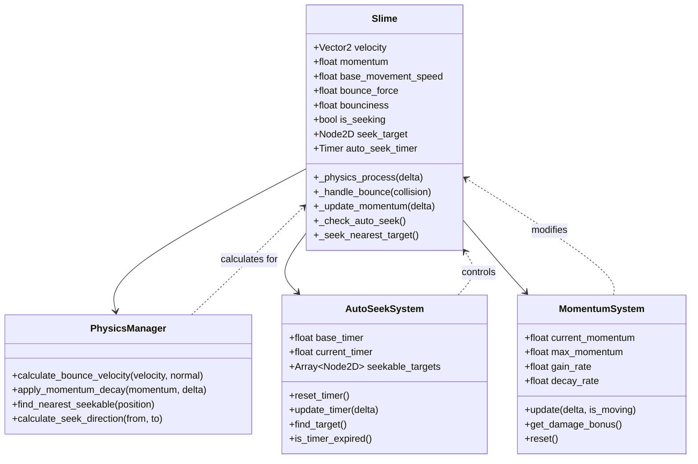
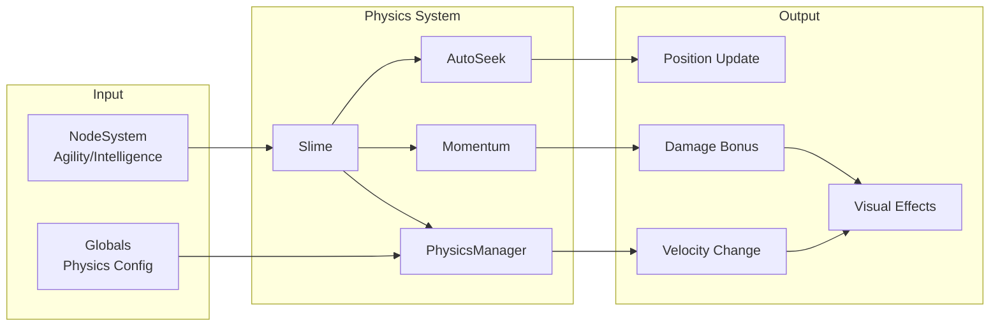
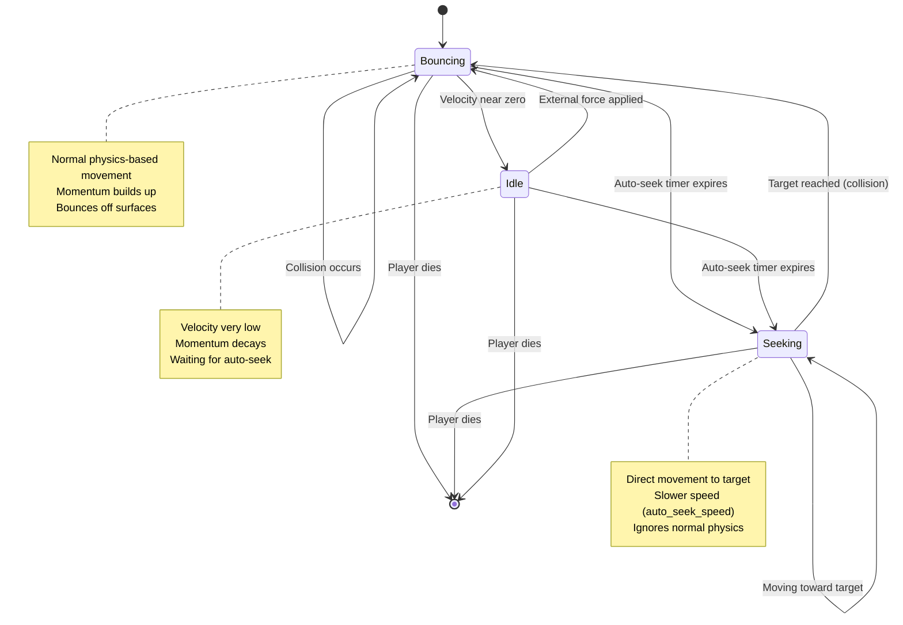
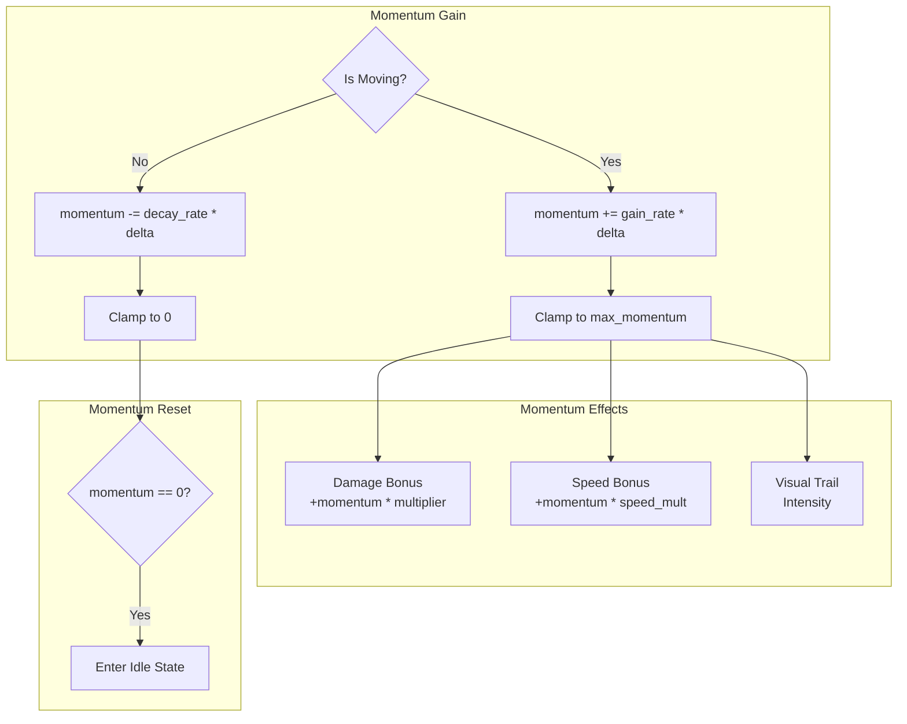
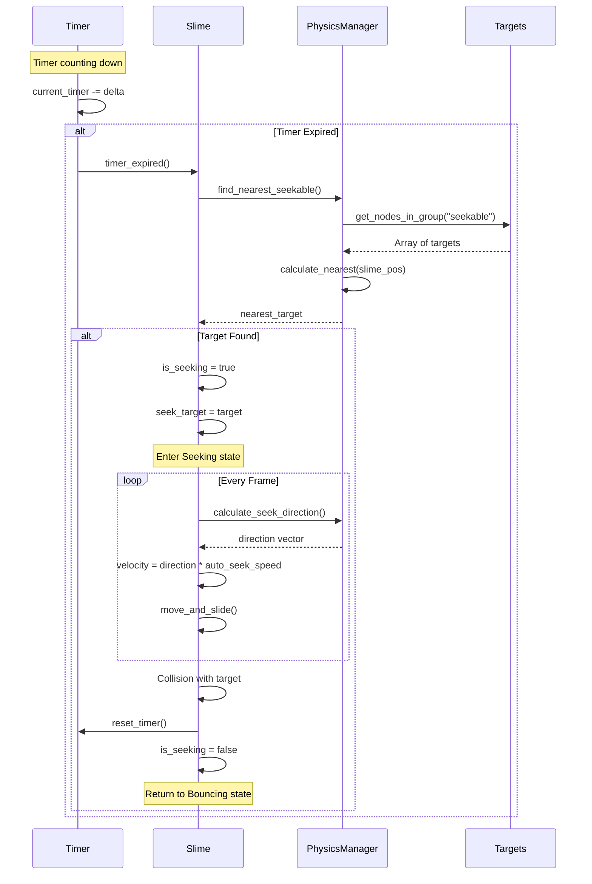

# Physics System Design

**Last Updated:** 2025-11-18  
**Status:** Design Complete - Ready for Implementation  
**Priority:** Critical (Core Mechanic)

---

## Table of Contents
1. [Overview](#overview)
2. [Architecture](#architecture)
3. [Movement States](#movement-states)
4. [Bounce Physics](#bounce-physics)
5. [Momentum System](#momentum-system)
6. [Auto-Seek Behavior](#auto-seek-behavior)
7. [File Structure](#file-structure)
8. [Implementation Steps](#implementation-steps)

---

## Overview

### Purpose
The Physics System manages the **autonomous movement** of the Slime entity. The player does NOT directly control the Slime's direction - instead, the Slime bounces around the room using physics-based movement with momentum buildup and automatic target seeking.

### Key Design Principles
- **No Direct Control:** Player cannot steer the Slime with WASD/arrows/gamepad
- **Physics-Driven:** Movement based on velocity, collisions, and bouncing
- **Momentum-Based:** Speed and damage increase with sustained movement
- **Auto-Seek:** Slime automatically targets enemies/obstacles when idle
- **Predictable:** Physics should feel consistent and learnable

### Core Mechanics
1. **Bouncing:** Slime bounces off walls, obstacles, and enemies
2. **Momentum:** Velocity builds up over time, increasing damage
3. **Auto-Seek:** After timer expires, Slime moves toward nearest target
4. **Focus Mode:** Enhanced targeting when few enemies remain (Intelligence node)

---

## Architecture

### Component Diagram



### System Interactions



---

## Movement States

### State Machine



### State Transitions

| From State | To State | Trigger | Action |
|------------|----------|---------|--------|
| Bouncing | Bouncing | Collision | Calculate bounce, apply force |
| Bouncing | Seeking | Timer expires | Find nearest target, set seeking=true |
| Bouncing | Idle | Velocity < threshold | Begin momentum decay |
| Idle | Seeking | Timer expires | Find nearest target, set seeking=true |
| Idle | Bouncing | External force | Resume normal physics |
| Seeking | Bouncing | Collision with target | Reset timer, apply bounce |

---

## Bounce Physics

### Bounce Calculation

```mermaid
flowchart TD
    Start[Collision Detected] --> GetNormal[Get Collision Normal]
    GetNormal --> Reflect[Reflect Velocity<br/>v' = v - 2(v·n)n]
    Reflect --> ApplyBounciness[Apply Bounciness<br/>v' *= bounciness]
    ApplyBounciness --> CheckMin{Velocity ><br/>Min Threshold?}
    CheckMin -->|Yes| ApplyVelocity[Set New Velocity]
    CheckMin -->|No| Stop[Stop Movement]
    ApplyVelocity --> ResetTimer[Reset Auto-Seek Timer]
    ResetTimer --> UpdateMomentum[Update Momentum]
    UpdateMomentum --> End[Continue Physics]
    Stop --> End
```

### Bounce Formula

**Reflection:**
```
v_reflected = v - 2 * (v · n) * n

Where:
- v = current velocity vector
- n = surface normal vector
- · = dot product
```

**Bounciness Application:**
```
v_final = v_reflected * bounciness

Where:
- bounciness = 0.0 to 1.0 (0 = no bounce, 1 = perfect bounce)
- Typical value: 0.7-0.9 for slime
```

### Exported Variables

```gdscript
# In Slime.gd
@export_group("Physics")
@export var base_movement_speed: float = 300.0
@export var bounce_force: float = 300.0
@export var bounciness: float = 0.8  # Velocity retention (0-1)
@export var min_bounce_velocity: float = 50.0  # Stop if below this
@export var wall_bounce_multiplier: float = 1.0
@export var obstacle_bounce_multiplier: float = 1.2
@export var enemy_bounce_multiplier: float = 0.9
```

---

## Momentum System

### Momentum Mechanics



### Momentum Formulas

**Momentum Gain:**
```
momentum += gain_rate * delta * velocity_factor

Where:
- gain_rate = base rate from Strength node
- delta = frame time
- velocity_factor = velocity.length() / base_movement_speed
```

**Momentum Decay:**
```
momentum -= decay_rate * delta

Where:
- decay_rate = constant decay when not moving
- Typical value: 5.0 (decays to 0 in ~2 seconds at max)
```

**Damage Bonus:**
```
bonus_damage = momentum * momentum_damage_multiplier

Where:
- momentum_damage_multiplier = 0.1 (10% of momentum as damage)
- Applied in combat calculation
```

### Exported Variables

```gdscript
# In Slime.gd
@export_group("Momentum")
@export var momentum_gain_rate: float = 10.0
@export var momentum_decay_rate: float = 5.0
@export var max_momentum: float = 100.0
@export var momentum_damage_multiplier: float = 0.1
@export var momentum_speed_multiplier: float = 0.05
```

---

## Auto-Seek Behavior

### Auto-Seek Flow



### Seekable Targets

**Group:** `"seekable"`

**Members:**
- All Defender entities
- All Obstacle entities (barrels, crates, etc.)
- NOT walls (TileMap collision)

**Setup:**
```gdscript
# In Defender._ready()
add_to_group("seekable")

# In Obstacle._ready()
add_to_group("seekable")
```

### Auto-Seek Timer

**Base Timer:** 9.0 seconds

**Intelligence Node Effect:**
```
effective_timer = base_timer - (intelligence_level * reduction_per_level)

Where:
- base_timer = 9.0 seconds
- reduction_per_level = 0.5 seconds (example)
- Min timer = 2.0 seconds (cap)
```

**Timer Reset Conditions:**
- Collision with any seekable target
- Collision with defender
- Collision with obstacle
- NOT reset on wall collision

### Exported Variables

```gdscript
# In Slime.gd
@export_group("Auto-Seek")
@export var auto_seek_timer_base: float = 9.0
@export var auto_seek_speed: float = 150.0  # Slower than bounce speed
@export var auto_seek_acceleration: float = 500.0
@export var seek_target_radius: float = 32.0  # Distance to consider "reached"
```

---

## File Structure

### Files to Modify

**Primary Implementation:**
```
scripts/entities/Slime.gd
├── Remove platformer movement code
├── Implement bounce physics
├── Add momentum system
├── Add auto-seek behavior
└── Add visual feedback
```

**Optional Helper System:**
```
scripts/systems/PhysicsManager.gd (optional)
├── Bounce calculation utilities
├── Target finding utilities
└── Physics constants
```

**Configuration:**
```
autoloads/Globals.gd
├── Physics constants
├── Movement speed modifiers
└── Collision layer definitions
```

### Scene Modifications

**Slime.tscn:**
```
Slime (CharacterBody2D)
├── Sprite2D (existing)
├── CollisionShape2D (existing)
├── DetectionZone (Area2D) - NEW
│   └── CollisionShape2D
├── MomentumTrail (Line2D) - existing, needs script
├── FocusIndicator (Sprite2D) - existing, needs script
└── AutoSeekTimer (Timer) - NEW
    ├── wait_time = 9.0
    ├── one_shot = false
    └── autostart = true
```

---

## Implementation Steps

### Phase 1: Remove Platformer Controls (Priority: Critical)

**Step 1.1:** Remove gravity and jump code
```gdscript
# DELETE these lines from Slime.gd
const SPEED = 300.0
const JUMP_VELOCITY = -400.0

func _physics_process(delta: float) -> void:
    # DELETE gravity code
    if not is_on_floor():
        velocity += get_gravity() * delta

    # DELETE jump code
    if Input.is_action_just_pressed("ui_accept") and is_on_floor():
        velocity.y = JUMP_VELOCITY

    # DELETE input movement code
    var direction := Input.get_axis("ui_left", "ui_right")
    if direction:
        velocity.x = direction * SPEED
    else:
        velocity.x = move_toward(velocity.x, 0, SPEED)
```

**Step 1.2:** Add exported physics variables
```gdscript
# ADD to Slime.gd
@export_group("Physics")
@export var base_movement_speed: float = 300.0
@export var bounce_force: float = 300.0
@export var bounciness: float = 0.8
@export var min_bounce_velocity: float = 50.0

@export_group("Momentum")
@export var momentum_gain_rate: float = 10.0
@export var momentum_decay_rate: float = 5.0
@export var max_momentum: float = 100.0
@export var momentum_damage_multiplier: float = 0.1

@export_group("Auto-Seek")
@export var auto_seek_timer_base: float = 9.0
@export var auto_seek_speed: float = 150.0

# Internal variables
var momentum: float = 0.0
var is_seeking: bool = false
var seek_target: Node2D = null
```

**Dependencies:** None
**Testing:** Slime should not respond to input, may fall through floor (expected)

---

### Phase 2: Implement Bounce Physics (Priority: Critical)

**Step 2.1:** Initialize random velocity
```gdscript
func _ready() -> void:
    super._ready()
    add_to_group("slime")
    _initialize_random_velocity()

func _initialize_random_velocity() -> void:
    var random_angle = randf_range(0, TAU)
    velocity = Vector2(cos(random_angle), sin(random_angle)) * base_movement_speed
```

**Step 2.2:** Implement bounce calculation
```gdscript
func _physics_process(delta: float) -> void:
    # Move and detect collisions
    var collision = move_and_slide()

    # Handle bounces
    if get_slide_collision_count() > 0:
        for i in get_slide_collision_count():
            var collision_info = get_slide_collision(i)
            _handle_bounce(collision_info)

func _handle_bounce(collision: KinematicCollision2D) -> void:
    var normal = collision.get_normal()

    # Reflect velocity
    velocity = velocity.bounce(normal)

    # Apply bounciness
    velocity *= bounciness

    # Check minimum velocity
    if velocity.length() < min_bounce_velocity:
        velocity = velocity.normalized() * min_bounce_velocity

    # Reset auto-seek timer
    _reset_seek_timer()
```

**Dependencies:** Step 1.1, 1.2
**Testing:** Slime should bounce around the room

---

### Phase 3: Implement Momentum System (Priority: High)

**Step 3.1:** Update momentum each frame
```gdscript
func _physics_process(delta: float) -> void:
    _update_momentum(delta)

    # ... existing movement code ...

    move_and_slide()

func _update_momentum(delta: float) -> void:
    var speed = velocity.length()

    if speed > min_bounce_velocity:
        # Gain momentum when moving
        var velocity_factor = speed / base_movement_speed
        momentum += momentum_gain_rate * delta * velocity_factor
        momentum = min(momentum, max_momentum)
    else:
        # Decay momentum when idle
        momentum -= momentum_decay_rate * delta
        momentum = max(momentum, 0.0)
```

**Step 3.2:** Expose momentum for combat
```gdscript
func get_momentum_damage_bonus() -> float:
    return momentum * momentum_damage_multiplier
```

**Dependencies:** Step 2.1, 2.2
**Testing:** Print momentum value, should increase when moving

---

### Phase 4: Implement Auto-Seek (Priority: High)

**Step 4.1:** Add Timer node to scene
- Open Slime.tscn in Godot editor
- Add Timer node as child of Slime
- Name it "AutoSeekTimer"
- Set wait_time = 9.0
- Set one_shot = false
- Set autostart = true
- Connect timeout signal to Slime script

**Step 4.2:** Implement timer logic
```gdscript
@onready var auto_seek_timer: Timer = $AutoSeekTimer

func _ready() -> void:
    super._ready()
    add_to_group("slime")
    _initialize_random_velocity()

    # Connect timer
    if auto_seek_timer:
        auto_seek_timer.timeout.connect(_on_auto_seek_timeout)
        auto_seek_timer.wait_time = auto_seek_timer_base

func _reset_seek_timer() -> void:
    if auto_seek_timer:
        auto_seek_timer.start(auto_seek_timer_base)
    is_seeking = false
    seek_target = null

func _on_auto_seek_timeout() -> void:
    _find_and_seek_target()
```

**Step 4.3:** Implement target finding
```gdscript
func _find_and_seek_target() -> void:
    var seekable = get_tree().get_nodes_in_group("seekable")
    if seekable.is_empty():
        return

    # Find nearest
    var nearest: Node2D = null
    var nearest_dist = INF

    for target in seekable:
        if target is Node2D:
            var dist = global_position.distance_to(target.global_position)
            if dist < nearest_dist:
                nearest_dist = dist
                nearest = target

    if nearest:
        is_seeking = true
        seek_target = nearest

func _physics_process(delta: float) -> void:
    _update_momentum(delta)

    if is_seeking and seek_target:
        _seek_target(delta)

    move_and_slide()

    # Handle bounces...

func _seek_target(delta: float) -> void:
    if not is_instance_valid(seek_target):
        is_seeking = false
        seek_target = null
        return

    var direction = (seek_target.global_position - global_position).normalized()
    velocity = direction * auto_seek_speed
```

**Dependencies:** Step 2.2, Defenders/Obstacles must be in "seekable" group
**Testing:** Slime should move toward nearest enemy after 9 seconds

---

### Phase 5: Visual Feedback (Priority: Medium)

**Step 5.1:** Implement momentum trail
```gdscript
@onready var momentum_trail: Line2D = $MomentumTrail

func _physics_process(delta: float) -> void:
    # ... existing code ...

    _update_visual_feedback()

func _update_visual_feedback() -> void:
    if momentum_trail:
        # Update trail opacity based on momentum
        var alpha = momentum / max_momentum
        momentum_trail.modulate.a = alpha

        # Update trail points (simple version)
        var trail_length = 5
        if momentum_trail.get_point_count() > trail_length:
            momentum_trail.remove_point(0)
        momentum_trail.add_point(global_position)
```

**Step 5.2:** Implement focus indicator
```gdscript
@onready var focus_indicator: Sprite2D = $FocusIndicator

func _update_visual_feedback() -> void:
    # ... momentum trail code ...

    if focus_indicator:
        focus_indicator.visible = is_seeking
        if is_seeking and seek_target:
            # Point toward target
            var direction = seek_target.global_position - global_position
            focus_indicator.rotation = direction.angle()
```

**Dependencies:** Step 3.1, 4.3
**Testing:** Visual trail should appear when moving, indicator when seeking

---

### Phase 6: Integration with NodeSystem (Priority: Medium)

**Step 6.1:** Apply Agility bonus to speed
```gdscript
func _ready() -> void:
    super._ready()
    # ... existing code ...
    _update_stats_from_nodes()

func _update_stats_from_nodes() -> void:
    if NodeSystem:
        # Agility affects movement speed
        var agility_bonus = NodeSystem.get_stat_bonus("movement_speed")
        var effective_speed = base_movement_speed * (1.0 + agility_bonus)

        # Update velocity magnitude if moving
        if velocity.length() > 0:
            velocity = velocity.normalized() * effective_speed
```

**Step 6.2:** Apply Intelligence bonus to timer
```gdscript
func _update_stats_from_nodes() -> void:
    if NodeSystem:
        # ... agility code ...

        # Intelligence reduces auto-seek timer
        var intelligence_level = NodeSystem.get_node_level("intelligence")
        var timer_reduction = intelligence_level * 0.5  # 0.5 sec per level
        var effective_timer = max(auto_seek_timer_base - timer_reduction, 2.0)

        if auto_seek_timer:
            auto_seek_timer.wait_time = effective_timer
```

**Dependencies:** NodeSystem implementation, Step 4.2
**Testing:** Upgrading Agility/Intelligence should affect movement

---

## Testing Strategy

### Test Scene: tests/TestBounce.tscn

**Setup:**
```
TestBounce (Node2D)
├── Slime (instance)
├── Walls (TileMap) - Create enclosed room
├── Obstacles (Node2D)
│   ├── Obstacle1 (Obstacle.tscn instance)
│   ├── Obstacle2 (Obstacle.tscn instance)
│   └── Obstacle3 (Obstacle.tscn instance)
└── TestDefender (Defender.tscn instance)
```

**Test Cases:**

1. **Bounce Test:**
   - Slime should bounce off walls
   - Velocity should decrease slightly each bounce (bounciness < 1.0)
   - Should not stick to walls

2. **Momentum Test:**
   - Momentum should increase when moving
   - Momentum should decay when idle
   - Print momentum value to verify

3. **Auto-Seek Test:**
   - Wait 9 seconds without collision
   - Slime should move toward nearest seekable
   - Timer should reset on collision

4. **Visual Test:**
   - Momentum trail should appear when moving
   - Focus indicator should point at target when seeking
   - Trail opacity should match momentum level

### Debug Visualization

```gdscript
# Add to Slime.gd for testing
func _draw() -> void:
    if Engine.is_editor_hint():
        return

    # Draw velocity vector
    draw_line(Vector2.ZERO, velocity.normalized() * 50, Color.RED, 2.0)

    # Draw seek target line
    if is_seeking and seek_target:
        var local_target = to_local(seek_target.global_position)
        draw_line(Vector2.ZERO, local_target, Color.GREEN, 1.0)

    # Draw momentum indicator
    var momentum_percent = momentum / max_momentum
    draw_circle(Vector2.ZERO, 20 + momentum_percent * 10, Color.YELLOW)

    queue_redraw()
```

---

## Performance Considerations

### Optimization Tips

1. **Target Finding:**
   - Cache seekable targets list
   - Only update when targets spawn/die
   - Use spatial partitioning for large rooms

2. **Collision Detection:**
   - Use appropriate collision layers
   - Limit collision checks per frame
   - Use Area2D for detection zones

3. **Visual Effects:**
   - Limit trail point count
   - Update visuals at lower frequency (every 2-3 frames)
   - Use object pooling for particle effects

### Collision Layers

```gdscript
# In project settings or Globals.gd
const LAYER_WORLD = 1      # Walls, static obstacles
const LAYER_PLAYER = 2     # Slime
const LAYER_ENEMY = 3      # Defenders
const LAYER_PROJECTILE = 4 # Future use

# Slime collision setup
collision_layer = LAYER_PLAYER
collision_mask = LAYER_WORLD | LAYER_ENEMY
```

---

## Known Issues & Solutions

### Issue 1: Slime Gets Stuck in Corners
**Solution:** Add minimum velocity threshold, apply random force when stuck

```gdscript
var stuck_timer: float = 0.0

func _physics_process(delta: float) -> void:
    # ... existing code ...

    if velocity.length() < min_bounce_velocity:
        stuck_timer += delta
        if stuck_timer > 2.0:
            _apply_unstuck_force()
            stuck_timer = 0.0
    else:
        stuck_timer = 0.0

func _apply_unstuck_force() -> void:
    var random_angle = randf_range(0, TAU)
    velocity = Vector2(cos(random_angle), sin(random_angle)) * bounce_force
```

### Issue 2: Auto-Seek Overshoots Target
**Solution:** Slow down when approaching target

```gdscript
func _seek_target(delta: float) -> void:
    # ... existing code ...

    var distance = global_position.distance_to(seek_target.global_position)
    var speed = auto_seek_speed

    # Slow down when close
    if distance < 100.0:
        speed *= distance / 100.0

    velocity = direction * speed
```

### Issue 3: Momentum Builds Too Quickly
**Solution:** Adjust gain_rate or add velocity factor cap

```gdscript
func _update_momentum(delta: float) -> void:
    var speed = velocity.length()

    if speed > min_bounce_velocity:
        var velocity_factor = min(speed / base_movement_speed, 2.0)  # Cap at 2x
        momentum += momentum_gain_rate * delta * velocity_factor
        momentum = min(momentum, max_momentum)
```

---

## Next Steps

After implementing the Physics System:
1. Implement [Combat System](SYSTEM_DESIGN_COMBAT.md) to use momentum for damage
2. Implement [Node System](SYSTEM_DESIGN_NODES.md) to provide stat bonuses
3. Test integration in [Core Loop](SYSTEM_DESIGN_CORE_LOOP.md)

---

**Implementation Priority:** Critical - Start Here
**Estimated Time:** 4-6 hours
**Dependencies:** None (foundational system)

